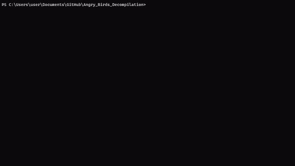

# ANGRY BIRDS Decompilation



## Where to install Angry Birds PC ports

If you don't know how to install Angry Birds PC ports, [here](https://archive.org/details/angry-birds-pc) is a link to the Internet Archive page for the PC ports of Angry Birds.

### Automatic decrypting

Firstly install [Python 3](https://www.python.org/downloads/).
You need to have [7z](https://www.7-zip.org/download.html) installed in the terminal.

Drag and drop the .lua file to birdout.py and choose what angry birds game it is. Then it will decrypt it for you automatically.
or you can run it in the terminal with:

    python birdout.py <file.lua> <file.lua> ...

passing only a folder will decrypt all .lua files in the directory.

    python birdout.py <directory> <directory> ...

Understandable, if you don't trust the .exe or the .jar file: openssl.exe. here is a virustotal scan: [virustotal](https://www.virustotal.com/gui/file/be0f086b9303fd52b6f5ec094c753c2b68f02559eb462f23929e72a6996eb1f8/detection/f-be0f086b9303fd52b6f5ec094c753c2b68f02559eb462f23929e72a6996eb1f8-1703249224)
and here scan for the unluac.jar: [virustotal](https://www.virustotal.com/gui/file/50f23c0b1cb85cc2bd07055ce782a918fdcb5d36d18d268b9606298d801bbb6e/detection/f-50f23c0b1cb85cc2bd07055ce782a918fdcb5d36d18d268b9606298d801bbb6e-1689512688)

## Manual Usage

if using linux, use wine to run the openssl.exe file.

```bash
wine openssl.exe ...
```

You will need to have [openssl](https://sourceforge.net/projects/openssl/) installed and in your Environment variables.
AND [7z](https://www.7-zip.org/download.html) installed in the terminal.
and [Java Development Kit (JDK)](https://www.freecodecamp.org/news/how-to-set-up-java-development-environment-a-comprehensive-guide/). [The Sketchy unluac.jar is a decompiler for .luac files.](https://sourceforge.net/projects/unluac/)

You need to run this to the .lua file you want to en or decrypt

### Decrypt

    openssl enc -aes-256-cbc -d -K [hex] -iv 0 -in [name].lua -out [new_name].lua.7z
then you need to open the new lua file with 7z and extract the content or copy.
then you should have .luac file. It will say that it is a .lua file but it is actually a .luac file.

then run:

    java -jar unluac.jar "file_encrypted.lua" > "file_decrypted.lua"
AND BOOM!

### Encrypt

With encrypting you need to do the opposite of decrypting.
Install [lua](https://www.lua.org/download.html)
to compile the .lua file to a .luac file.

    luac -o compiled.lua file.lua

then you need to run this:

    7z a -t7z -m0=lzma -mx=9 -mfb=64 -md=32m -ms=on file_encrypted.lua.7z compiled.lua

then you need to run this:

    openssl enc -aes-256-cbc -e -K [hex] -iv 0 -in file_encrypted.lua.7z -out file_encrypted.lua

## Keys

Angry Birds

    Hex = 55534361505170413454534E56784D49317639534B39554330795A75416E6232
    
    Str = USCaPQpA4TSNVxMI1v9SK9UC0yZuAnb2

Angry Birds: Rio

    Hex = 55534361505170413454534E56784D49317639534B39554330795A75416E6232

    Str = USCaPQpA4TSNVxMI1v9SK9UC0yZuAnb2

Angry Birds: Seasons

    Hex = 7A65506865737435666151755832533241707265403472654368417445765574
    
    Str = zePhest5faQuX2S2Apre@4reChAtEvUt

Angry Birds: Space

    Hex = 526D67645A304A656E4C466757776B5976434C326C5361684662456846656334
    
    Str = RmgdZ0JenLFgWwkYvCL2lSahFbEhFec4

Angry Birds: Star Wars

    Hex = 416E3874336D6E38553673706951307A4848723361316C6F44725261336D7445
    
    Str = An8t3mn8U6spiQ0zHHr3a1loDrRa3mtE

Angry Birds: Star Wars II

    Hex = 4230706D3354416C7A6B4E3967687A6F65324E697A456C6C50644E3068516E69
    
    Str = B0pm3TAlzkN9ghzoe2NizEllPdN0hQni

## credos

half stuff found in this sketchy forum site:
    [https://web.archive.org/web/20231015200421/https://forum.xentax.com/viewtopic.php?t=9840](https://web.archive.org/web/20231015200421/https://forum.xentax.com/viewtopic.php?t=9840) is a link to the forum post discussing the encryption of settings and highscores in Angry Birds Rio.
Needed to save it in the wayback machine because the site is going to be shut down on December, 2023.
Heres more forum stuff:
[https://web.archive.org/web/20231015200746/https://xdaforums.com/t/q-angry-birds-rio-encrypts-settings-highscores-with-aes.1015380/](https://web.archive.org/web/20231015200746/https://xdaforums.com/t/q-angry-birds-rio-encrypts-settings-highscores-with-aes.1015380/) is a link to the forum post discussing the encryption of settings and highscores in Angry Birds Rio.
